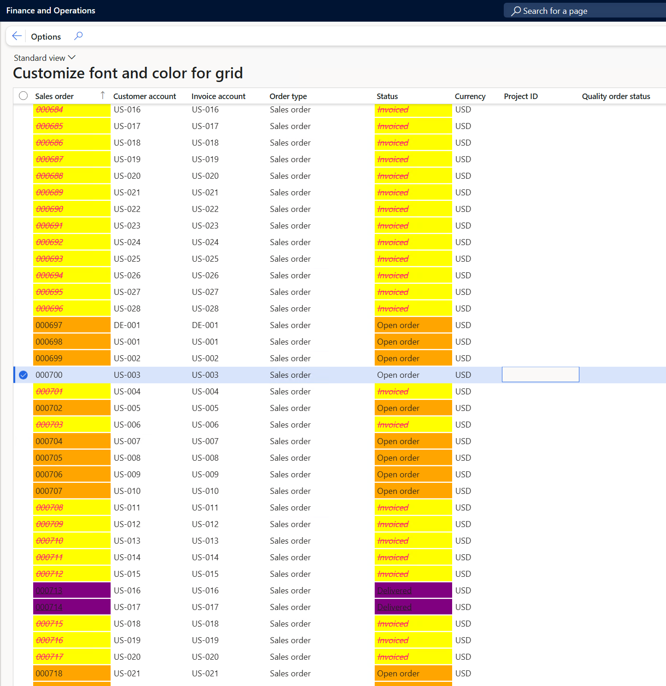
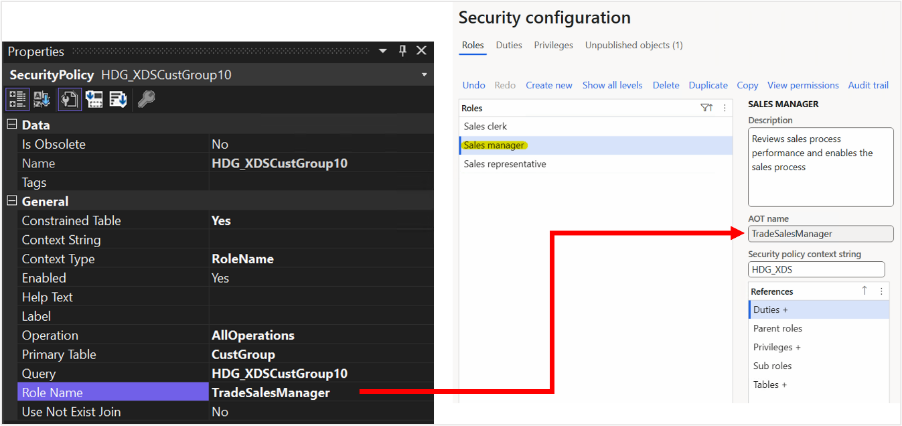
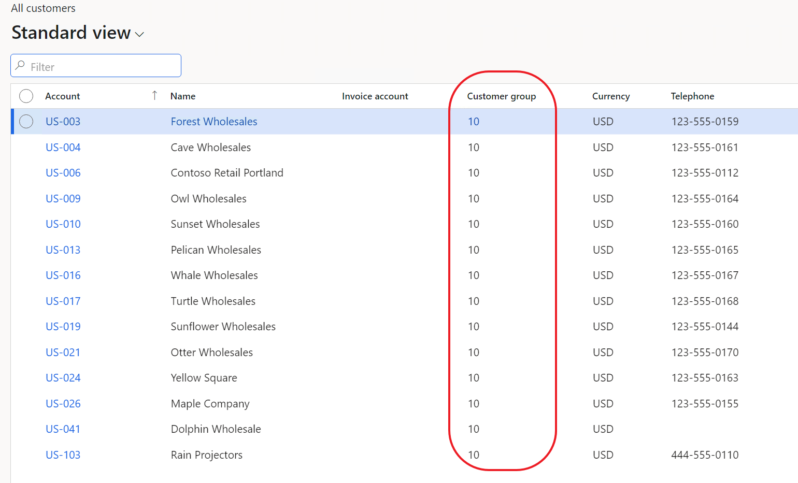

# HDG-Dynamics365-X++-Samples
Code sample collection of D365 ERP written in X++.
Written by Dong-Gyun Ha.

# Execute direct SQL from Dynamics365 ERP form

[Execute_Direct_Query_From_D365FO](./Execute_Direct_Query_From_D365FO)

In order to overcome the limitation of not being able to create and execute a direct query in the cloud version, it is a function that allows you to create a query yourself on the form.

Refer : [XppTools Git](https://github.com/TrudAX/XppTools/tree/master/DEVTools/DEVSQLExecute)   
I have refactored the code in the above reference link. Also, I add the some functions that if update mode is selected then enabling only screen output.

# Send an email to the SSRS report as an attachment

[Report_Send_Email](./Report_Send_Email)

Please refer "Report_Send_Email" folder.

Linked In : [Linked In](https://www.linkedin.com/posts/donggyun-ha-9a3724233_dynamics365-xpp-ssrs-activity-7170416425050861568-DjvX?utm_source=share&utm_medium=member_desktop) 

# Send an email

[Send_Email](./Send_Email)

Please refer "Send_Email" folder.

Document : [Microsoft document](https://learn.microsoft.com/en-us/dynamics365/fin-ops-core/dev-itpro/dev-tools/sysmailer-develop?context=%2Fdynamics365%2Fcontext%2Fcommerce#sending-emails) 

# Message API

[Message_Alert_Function](./Message_Alert_Function)

Various Message API practice codes.

Document : [Microsoft document](https://learn.microsoft.com/en-us/dynamics365/fin-ops-core/dev-itpro/user-interface/messaging-api-center-bar-details)

Linked In : [Linked In](https://www.linkedin.com/posts/donggyun-ha-9a3724233_dynamics365-erp-xpp-activity-7170427349790916608-2_Df?utm_source=share&utm_medium=member_desktop) 

## Add action on message / Set prefix

Refer HDGMessage_MessagingAPI::addPrefix(); / HDGMessage_MessagingAPI::addAction();

## Add message to action center

Refer HDGMessage_MessagingAPI::addActionCenter();

# Purchase receipt

[Purch_Receipt_MutipleWay](./Purch_Receipt_MutipleWay/AxClass)

There are multiple way to purchase receipt through X++.

1. Using purchFormLetter.update()
- You can find this method in [HDGPurchReceipt_PruchReceiptHelper.purchReceiptOnePO()](./Purch_Receipt_MutipleWay/HDGPurchReceipt_PruchReceiptHelper.xml)

2. Using query
- You can find this method in [HDGPurchReceipt_PruchReceiptHelper.purchReceiptUsingQuery()](./Purch_Receipt_MutipleWay/HDGPurchReceipt_PruchReceiptHelper.xml)

3. Partial purchase receipt with item registration 
- You can find this method in [HDGPurchReceipt_PurchReceiptPartialHelper](./Purch_Receipt_MutipleWay/HDGPurchReceipt_PurchReceiptPartialHelper.xml)

- Also, the test code is [HDGPurchReceipt_MainTest](./Purch_Receipt_MutipleWay/HDGPurchReceipt_MainTest.xml) (This class is simply an example of how to call a function. I hope you customize it according to your situation.)

## Correct purchase receipt

[Correct purchase receipt code](./Purch_Receipt_Correct/AxClass)

- In the example above, if you have purchased and receipt, in this example, you can see the correct purchase receipt.
- This is very smiliar with [Purch_Receipt_MutipleWay](./Purch_Receipt_MutipleWay/AxClass).
- Also, they use same data contract class [DataContractClass](./Purch_Receipt_MutipleWay/AxClass/HDGPurchReceipt_PurchReceiptPartialContract.xml).

# Customize font and color for Grid

The following example shows how you can change the way that the cells of a table control are colored.

[Customize_Font_And_Color_For_Grid](./Customize_Font_And_Color_For_Grid)

# XDS - Security policy

This sample provides an overview of Extensible Data Security (XDS) policies in Finance and operations apps. 
XDS allows developers to supplement role-based security by restricting access to table records based on security policies. 
The query in the policy applies a filter and only records that satisfy the conditions of the filter will be accessible from the restricted tables.

Linked in : [Linked In](https://www.linkedin.com/posts/donggyun-ha-9a3724233_dynamics365-dynamicsax-xds-activity-7174780556327485440-Yw7e?utm_source=share&utm_medium=member_desktop)

[XDS sample code](./SecurityPolicy_XDS)

